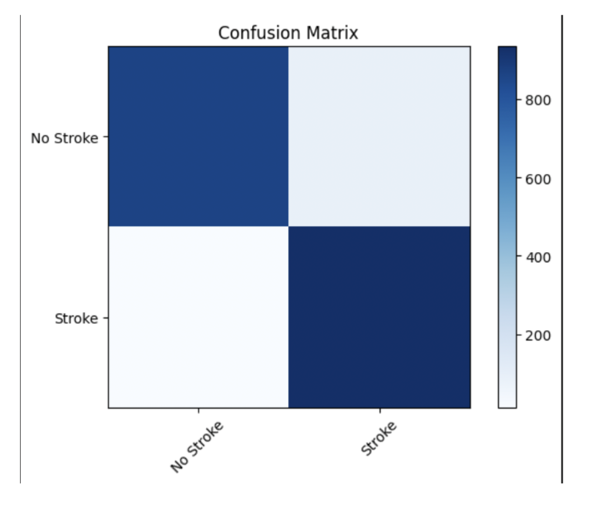
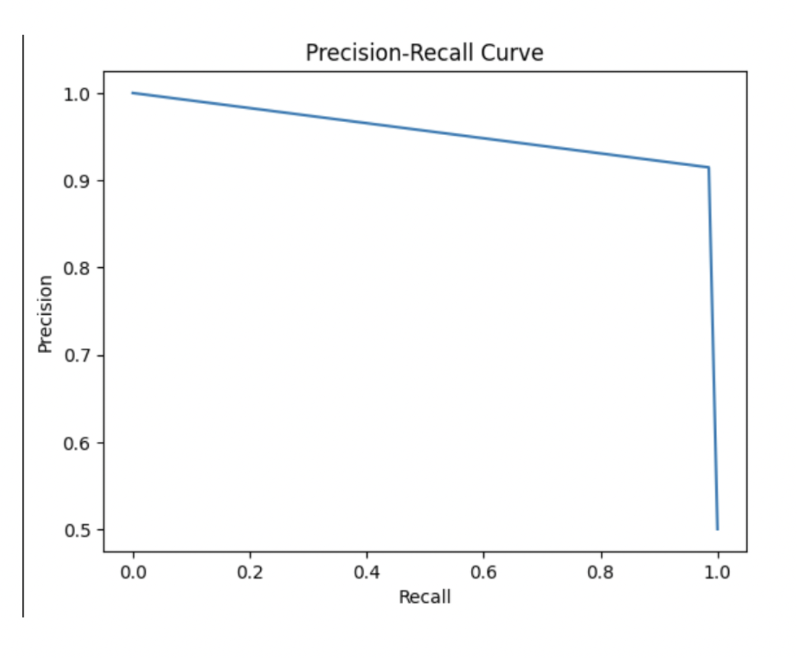
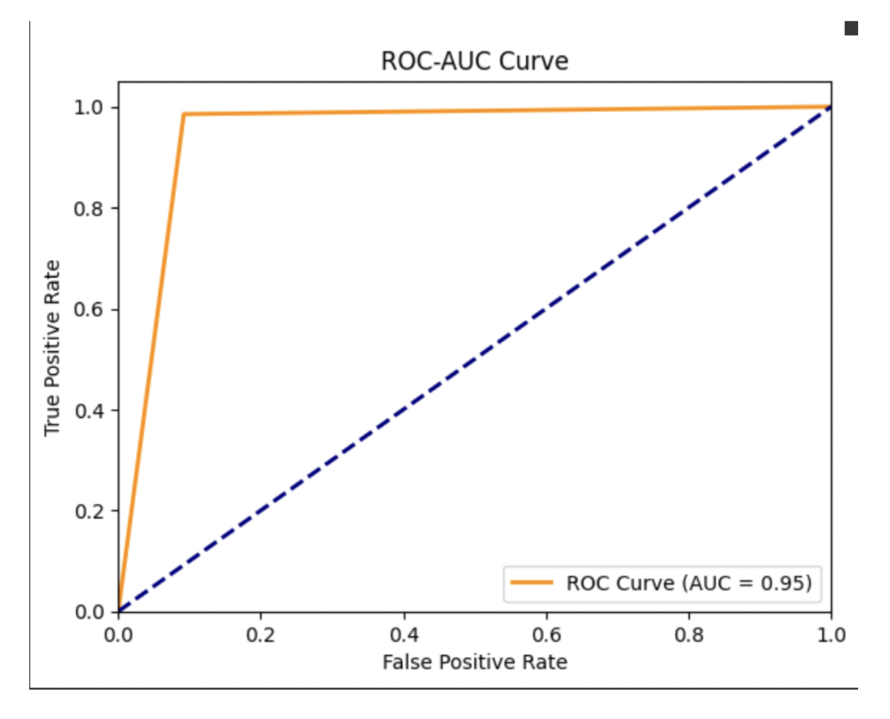
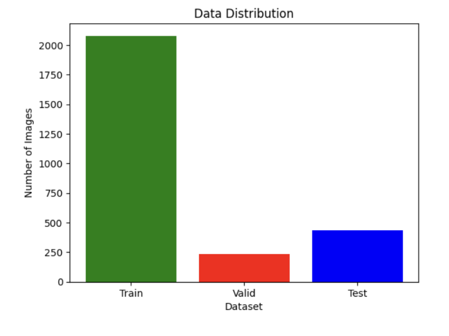
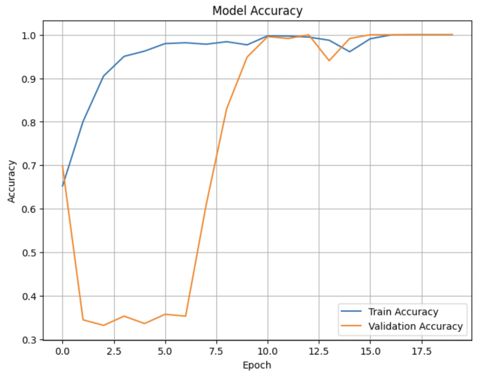
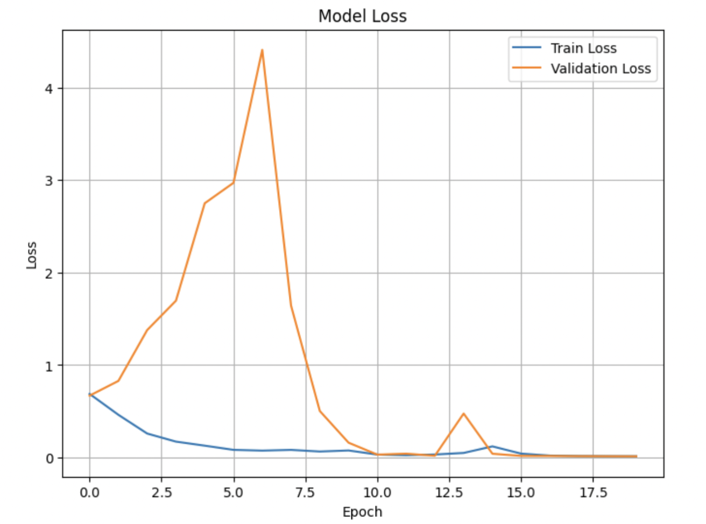
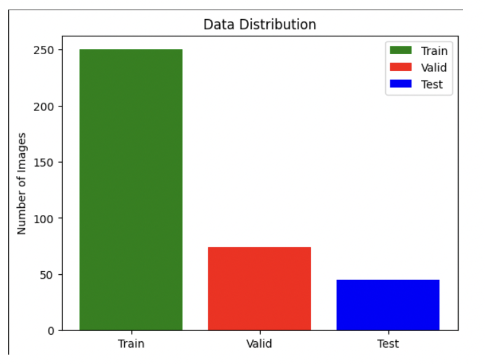
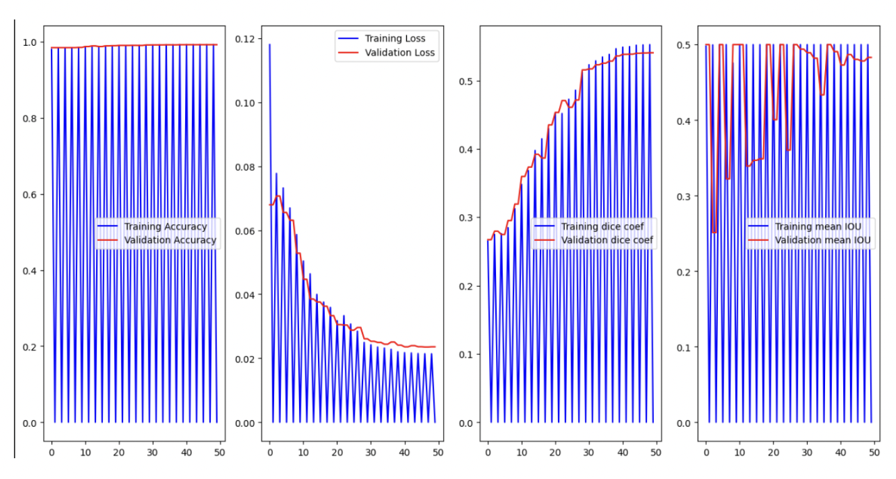
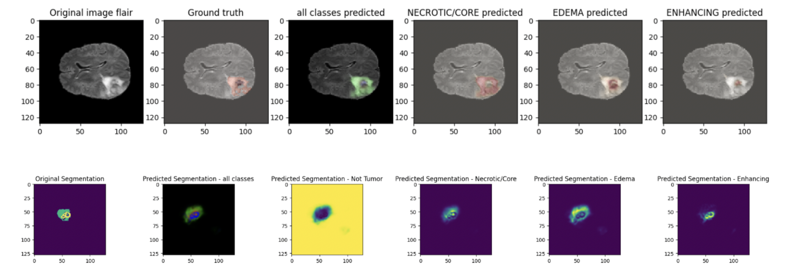

# Brain Disease Detection System

## Overview
### Brain Stroke
A brain stroke, also known as a cerebrovascular accident (CVA), occurs when blood flow to a part of the brain is interrupted, leading to brain cell damage. Symptoms may include sudden numbness, difficulty speaking, and severe headache. Timely diagnosis and treatment are critical, as early intervention can significantly improve recovery outcomes.

### Brain Tumor
A brain tumor is an abnormal growth of cells within the brain or surrounding tissues. Tumors can be benign (non-cancerous) or malignant (cancerous) and can arise from brain cells or spread from other parts of the body.

This project is a comprehensive and efficient Brain Stroke and Tumor Detection System built using advanced machine learning and medical imaging techniques. It aims to aid medical professionals in the early diagnosis of strokes and brain tumors, potentially improving patient outcomes through timely intervention.

## Key Features
### Brain Stroke Detection 
- **Enhanced MLP Neural Network:** Utilizes a Multi-Layer Perceptron (MLP) model to predict the likelihood of a brain stroke based on various input features.
- **Classification of Brain Stroke:** Implements a Convolutional Neural Network (CNN) to analyze MRI/CT images and classify brain strokes as either **ischemic** or **hemorrhagic**.
  
### Brain Tumor Detection and Segmentation 
- U-Net Model for Segmentation: Employs a U-Net architecture to segment brain tumors in medical images. This model is specifically trained to identify and classify the following features:
    - **No Tumor:** Indicates the absence of any tumor.
    - **Necrotic/Core:** Represents dead or dying tissue within a tumor, suggesting advanced tumor progression.
    - **Edema:** Detects swelling caused by excess fluid around the tumor, which can indicate the tumor's impact on surrounding brain tissue.
    - **Enhancing:** Identifies areas of the tumor that show abnormal blood vessels and a disrupted blood-brain barrier.

### Web-Based Implementation
- **Frontend Technologies:** Developed using HTML, JavaScript, and CSS, providing a user-friendly interface for interaction.
- **Backend Framework:** Utilizes Flask to handle requests and manage the backend logic of the application, including model predictions and image processing.

### Predictive and Diagnostic Capabilities
- **Predictive Analysis:** Provides predictions on stroke likelihood based on user-input features, aiding in early diagnosis.
- **Tumor Feature Identification:** Helps in identifying specific tumor characteristics, which can guide treatment decisions.
  
**Technologies used -** 
 - Frontend: HTML, CSS, JavaScript
 - Backend: Python, Flask
 - Machine Learning: NumPy, Pandas, scikit-learn, TensorFlow or Keras
 - Deep Learning: Convolutional Neural Networks (CNN), U-Net architecture, Multi-Layer Perceptron (MLP)
 - Data Visualization: Matplotlib 

## Dataset
### Source
- <a href="https://www.kaggle.com/code/alphajr7/95-accuracy/input?select=brains_Stroke_final+-+brains_Stroke_final.csv" target="_blank">Brain Stroke Dataset</a>
- <a href="https://www.kaggle.com/datasets/noshintasnia/brain-stroke-prediction-ct-scan-image-dataset/data" target="_blank">CT Scan Image Dataset</a>
- <a href="https://www.kaggle.com/datasets/awsaf49/brats2020-training-data" target="_blank">BRATS 2020 Training Data</a>
 
## Model Performance
### Evaluation Metrics
- Accuracy
- Precision
- Recall
- Confusion Matrix
- F1-score
- ROC-AUC
- Validation Loss
- Sensitivity
- Specificity
  
### Best Models Results
**Multi-Layer Perceptron (MLP):**
- Accuracy: 94.67%
- Precision: 0.91
- F1 Score: 0.95
- Validation Loss: 0.0136
  
**CNN Architecture:**
- Accuracy: 98.1%
- Test Loss: 0.627
  
**U-Net Architecture:**
- Precision: 99.4%
- Specificity: 99.79%
- Sensitivity: 99.04%
  
## Model Evaluation and Visualizations

  
Multi-Layer Perceptron (MLP) - 

  
Confusion Matrix:

  

  
Precision-Recall Curve:

  

  
ROC-AUC Curve:

  

### CNN Architecture -
### Data Distribution

### Accuracy VS Epoch

### Loss VS Epoch

### U-Net Architecture 
### Data Distribution

### Accuracy Graph

### Predicted VS Original Segmentation 

## Metrics
Table or list summarizing the key evaluation metrics
## Visualizations
Brief descriptions of the visualizations included
## Contributing
Guidelines for contributing to the project
### Step-by-Step Contribution Guide
Detailed steps for contributing to the project
## License
Information about the license under which the project is released
## Contact
### Author
Your name and contact information
### Project Link
Link to the project repository or website
## Acknowledgments
Acknowledgments for datasets, inspiration, or other forms of assistance
Optional Headings (depending on the project's specific needs):

## Future Work
Plans for future development or enhancements
## Known Issues
List of known issues or limitations
## Troubleshooting
Tips for troubleshooting common problems
## References
List of references used in the project (e.g., research papers, articles)
